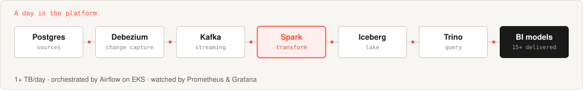

### Anmol Mishra

**Software Engineer — Distributed Data Platform**  ·  Bangalore, India

---

## What I actually do

I care about what happens to data **before** anyone models it.

Most of the interesting failures in a data platform don't happen in the model — they happen
three systems upstream, in a schema nobody owned, in a CDC stream that silently dropped a
column, in a join that was fine until the partition skewed. That's the layer I work at.

At **Hewlett Packard Enterprise** I design and operate the batch and streaming pipelines
behind the Distributed Data Platform:

| | |
|---|---|
| **1+ TB / day** | processed across batch and streaming pipelines |
| **15+ BI data models** | delivered for Customer Success, FinOps and Engineering |
| **95%+** | production incident SLA compliance |

---

## Open source

| Project | Contribution | Status |
|---|---|---|
| **[Apache Spark](https://github.com/apache/spark/pull/58760)** | `SPARK-59146` — retain qualified access to source columns affected by pipe `SET`, with planner changes and SQL test coverage | open |
| **[AWS PyDeequ](https://github.com/awslabs/python-deequ/pull/289)** | DQDL support via `EvaluateDataQuality`, with tests and documentation | **merged** |

---

## Building

**RaftDB** — a mini distributed database, written from scratch because I didn't want
consensus, recovery and query optimization to stay black boxes.
Raft consensus, leader election, log replication, WAL, snapshots, SSTables, Bloom filters
and background compaction — with a cost-based SQL layer on Apache Calcite over the top.
`Java` · `Raft` · `LSM Tree` · `RocksDB` · `Apache Calcite`

**Data quality research** — working toward a cloud-native data quality framework for
open-source datasets: validation systems, error detection, label noise and LLM-driven
cleaning.

Public experiments →
[AIOps Platform](https://github.com/AMC-hawk/AIOps-Platform-POC) ·
[JanusGraph](https://github.com/AMC-hawk/JanusGraph-POC) ·
[Airflow + Spark](https://github.com/AMC-hawk/Airflow-Spark-Setup) ·
[MCP Server](https://github.com/AMC-hawk/MCP_Server_LocalSetup) ·
[MLflow](https://github.com/AMC-hawk/ML_Flow_Setup) ·
[Scala REST API](https://github.com/AMC-hawk/scala-rest-api)

---

## Stack

**Data**

**Languages**

**Platform**

**Observability**

---

**B.Tech Computer Science & Engineering**, Vellore Institute of Technology · 8.81 / 10

Interested in distributed systems, database internals, performance engineering
and AI-powered data platforms.

**[amc-hawk.github.io](https://amc-hawk.github.io)**

